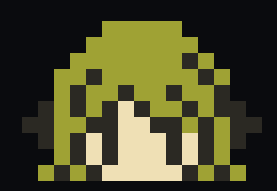

<h1 align="center">gh-reva</h1>

<p align="center">
  
</p>

<p align="center">PR review TUI distributed as a <code>gh</code> CLI extension.</p>

`gh-reva` is a four-pane terminal viewer for GitHub Pull Requests with a focus
on per-file review flow: pin a file, then walk only the commits that touch it
without losing your place in the diff or comments.

<p align="center">
  
</p>

## Install

```sh
gh extension install ktrysmt/gh-reva
```

The first run downloads the precompiled binary that matches your OS and
architecture from the latest GitHub release.

## Usage

```sh
gh reva <PR-number>            # explicit PR in the current repo
gh reva <PR-URL>               # any PR by URL
gh reva                        # auto-detect the PR for the current branch
```

The TUI requires a real terminal (TTY); piping output is not supported.

## Layout

```
+-------------+----------------+----------------+
| [1] Files   |                |                |
+-------------+   [3] Diff     |  [4] Comments  |
| [2] Commits |                |                |
+-------------+----------------+----------------+
```

The active pane is marked with `▶ <Pane>`. The cursor row in every pane is
prefixed with `> `. Visual selection extends `> ` across the selected range.

## Keymap

| Key | Action | Active panes |
| --- | --- | --- |
| `tab` / `shift-tab` | Cycle panes Files → Commits → Diff → Comments | All |
| `j` / `k` | Move cursor up / down | All |
| `Shift-J` / `Shift-K` | Advance to next / previous file (focus preserved) | All |
| `H` / `M` / `L` | Top / middle / bottom of viewport | Diff |
| `gg` / `G` | Buffer start / end | Diff |
| `Ctrl-d` / `Ctrl-u` | Half-page down / up | Diff |
| `Ctrl-f` / `Ctrl-b` | Full-page down / up | Diff |
| `<space>` | Files / Commits: toggle hover popup • Diff: split⇄unified | Files, Commits, Diff |
| `t` | Files: toggle flat ⇄ tree rendering | Files |
| `Enter` | Tree mode only: fold / unfold directory under cursor | Files |
| `v` / `y` / `Esc` | Visual mode + yank to clipboard / cancel | All |
| `q` / `Ctrl-C` | Quit | All |

`tab` / `shift-tab` are the only keys that move focus between panes. `j` / `k`
in Files and Commits auto-selects the cursor row, so the Diff and Comments
panes follow the cursor live without an explicit drill-in step.

### Visual yank shapes

- Files: file path(s), newline-separated
- Commits: `<sha> <subject>` per row
- Comments: `<user> @ <date>\n<body>` per row
- Diff: raw line(s) of the patch buffer

## Per-file commit history

The Commits pane is auto-filtered by the cursor file in Files: only
commits that touched it are listed, with an `[A] / [M] / [D] / [R]`
annotation showing how each one changed the file. Move the Files cursor
to switch the filter; there is no separate pin / unpin step.

## Comments view rules

- Coupled to the Diff cursor: the pane shows only threads anchored at the
  current Diff buffer line (the rows decorated with `◆`). When the cursor is
  not on a `◆` row, the column reads `(no comment at cursor)`.
- Whole-PR view filters to active threads (non-outdated, anchored to HEAD);
  single-commit view shows comments anchored to that commit (including ones
  that became outdated against HEAD), tagged with `[outdated]` when relevant.
- Threads always render fully expanded with replies indented under the root.
  Moving the Comments cursor (`j` / `k`) auto-scrolls the Diff pane to the
  buffer line of the cursored comment.

## Color theming

`gh-reva` ships with `gruvbox` as the default palette. Pass `--theme
<name>` to swap in any chroma styles registry entry (`dracula`, `nord`,
`tokyonight-night`, `monokai`, `builtin-dark`, and 70+ others). Run
`gh reva --list-themes` to see every accepted name.

```sh
gh reva --theme dracula
gh reva --no-color           # also honors NO_COLOR / CLICOLOR
GH_REVA_THEME=nord gh reva     # env var fallback when --theme is not set
```

The chosen theme drives per-token syntax foreground inside diff content,
pane chrome (border / title / status badges), the cursor accent, and the
spinner. Diff add / delete signals are deliberately theme-independent: the
row-wide bg is a uniform dark green (`#0d3b13`) / dark red (`#3b0d0d`) and
the leading `+` / `-` marker is bold bright green (`#3fb950`) / bright red
(`#f85149`) regardless of theme — so the change extent and direction read
at a glance even when a palette ships unusual diff hues. Light backgrounds
are not yet auto-detected — picking a light-theme name on a dark terminal
is allowed but may render with poor contrast.

| Flag | Purpose |
| --- | --- |
| `--theme <name>` | Pick a color palette (default: `gruvbox`) |
| `--no-color` | Disable color output. Also reads `NO_COLOR` / `CLICOLOR` |
| `--list-themes` | Print every accepted theme name on stdout and exit 0 |

## Cursor row hover

In Files and Commits, press `<space>` to toggle a small bordered popup
that mirrors the cursor row's full content: path + comment count for
Files, `<sha> <subject>` plus the commit body for Commits. The popup
hovers above the cursor row, anchored to the path / SHA column so its
text lines up with the row below. While the popup is open, `j` / `k`
update its body to the new cursor row; pressing `<space>` again closes
it.

## Development

```sh
go mod tidy
go build ./...
go vet ./...
go run . --fixture testdata/sample-pr.json
```

### End-to-end tests

```sh
cd ./e2e/
pnpm install        # first run only
pnpm test           # runs `go build` then node --test against tuistory
pnpm run test:smoke # smoke subset
```

The runner relies on `tuistory` plus `--test-force-exit` to handle the
bubbletea PTY. If a hung child slows you down, `pkill -f 'gh-reva --fixture'`
clears it.

### Test-only flags

| Flag | Purpose |
| --- | --- |
| `--fixture <path>` | Load PR data from a JSON fixture (skips the gh API) |
| `--simulate-error <kind>` | Inject `unauth` / `not_found` / `rate_limit` errors |
| `--slow-load <duration>` | Inject a per-call delay so the loading spinner is observable |
| `--diff-height <int>` | Pin the Diff viewport height (used by F6 viewport assertions) |

The simulate-error, slow-load, and diff-height flags are hidden from `--help`
and only intended for the E2E suite.

### Stress fixture

A larger fixture (60 commits, 120 files) lives at `testdata/large-pr.json`.
Regenerate it with:

```sh
go run testdata/gen_large_fixture.go testdata/large-pr.json
```

The TUI shows a Braille spinner with a stage label (`metadata`, `commits`,
`files`, `comments`, `diffs`) while loading.

## Release process

Releases are produced by `goreleaser` from a `v*` tag pushed to the default
branch (see `.github/workflows/release.yml`).

Sanity-check locally:

```sh
goreleaser release --snapshot --clean
```

This produces `dist/` with per-OS/arch binaries named `gh-reva_<os>_<arch>`,
`checksums.txt`, and a snapshot manifest. The same name template is what
`gh extension install` consumes from a real release.

## License

MIT
